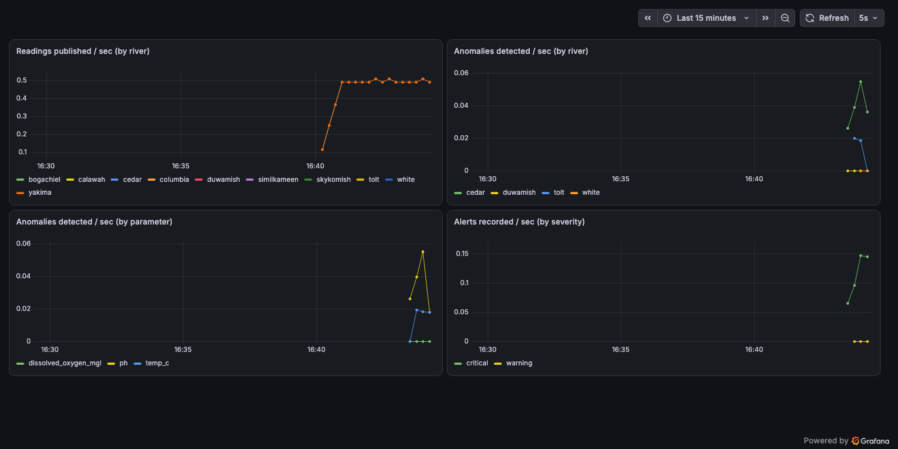
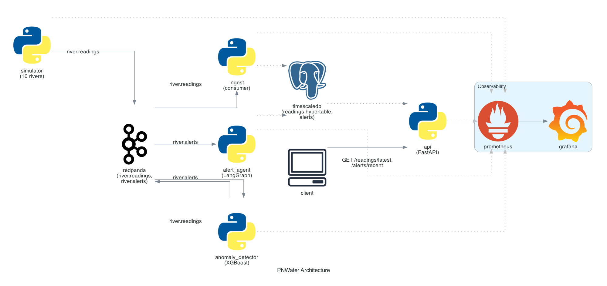

# PNWater

[](https://github.com/kartik117/pnwater/actions/workflows/ci.yml)

Real-time water-quality monitoring for 10 real Pacific Northwest rivers. Simulated sensors stream readings through Kafka into TimescaleDB; an XGBoost model trained on per-river z-scores flags anomalies; a LangGraph agent turns flagged events into severity-classified alerts, with an optional LLM step for plain-language explanations.



## The rivers are real

The 10 monitored locations are real USGS gauges — Yakima River, Columbia River, Cedar River, and 7 others — and their baseline temperature/dissolved-oxygen/pH/turbidity statistics were pulled live from [USGS NWIS](https://waterservices.usgs.gov/nwis/iv) on 2026-06-26, not invented. See [`src/pnwater/rivers.py`](src/pnwater/rivers.py) for exactly which numbers are real readings vs. regional-typical fallbacks (most WA gauges instrument temperature and turbidity but not dissolved oxygen or pH). One gauge returned USGS's `-999999` missing-data sentinel for turbidity — caught and replaced with the regional fallback rather than treated as a real value.

## How it works



`simulator` generates one synthetic reading per river per tick around its real baseline, with a 3% chance per tick of injecting an anomaly into a random parameter — and then discards the fact that it did. `anomaly_detector` has to find it from the value alone, the same way it would for a real sensor fault.

The model is trained on **per-river z-scores, not raw values**: Yakima River runs warm (~23°C baseline) and Columbia River runs cold (~10°C) — a model trained on absolute temperature would learn "high temp is anomalous" and flag every normal Yakima reading. Normalizing each parameter against that specific river's own baseline before training means one XGBoost model generalizes across all 10 rivers (`src/pnwater/ml/features.py`).

`alert_agent` runs a real [LangGraph](https://github.com/langchain-ai/langgraph) `StateGraph`: `classify_severity → format_message → llm_explain`. The LLM step is genuinely optional — `get_llm_client()` constructs the Gemini client lazily and returns `None` with no API key configured, and `llm_explain` treats `None` as "keep the deterministic message," not an error. No key is configured in CI, on purpose, so the no-key path is the one actually exercised by default.

## Stack

Python 3.11 · FastAPI · aiokafka · Redpanda · TimescaleDB (Postgres) · XGBoost + scikit-learn · LangGraph · langchain-google-genai (optional) · Prometheus + Grafana · pytest · Docker Compose

## Running it

```bash
docker compose up -d --build
curl http://localhost:8001/rivers
curl http://localhost:8001/readings/latest
curl http://localhost:8001/alerts/recent
```

Grafana is at `localhost:3000` (anonymous viewer access enabled), Prometheus at `localhost:9090` — both provisioned automatically.

To enable the LLM explanation step, pass a Gemini key: `PNWATER_GOOGLE_API_KEY=... docker compose up -d --build alert_agent`.

**Retraining the model:**

```bash
source .venv/bin/activate
pip install -e ".[dev]"
python -m pnwater.ml.train
# accuracy 0.994, precision 0.992, recall 0.975, f1 0.983, roc_auc 0.9999
# (high because the synthetic anomalies are deliberately well-separated --
# a claim about separability of this synthetic distribution, not real-world
# sensor-fault detection rates)
```

**Local development (no Docker):**

```bash
python3.11 -m venv .venv && source .venv/bin/activate
pip install -e ".[dev]"
pytest        # 28 tests, no Postgres/Kafka required
ruff check .
```

## Engineering notes

Two real bugs, both only found by actually running the stack against real containers, neither caught by the unit tests:

**`create_hypertable()` failed outright.** TimescaleDB requires the partitioning column to be part of every unique constraint on a hypertable — uniqueness can't be cheaply enforced across partitions otherwise. `ReadingRow`'s primary key was originally just `id`; fixed by making it a composite `(id, recorded_at)` key. The SQLite-backed tests never caught this because `init_db()` against SQLite skips hypertable creation entirely — this only fails against real TimescaleDB.

**`anomaly_detector` crashed on startup looking for the model in the wrong place.** `train.py` originally computed `MODEL_PATH` as `Path(__file__).resolve().parents[3]`, which finds the repo root when running from a source checkout but resolves to somewhere under the Python install once the package is `pip install`-ed — exactly what the Dockerfile does. Fixed by moving the path into `Settings` (resolved relative to the working directory, matching the Dockerfile's `WORKDIR /app` where `models/` is actually copied to) instead of deriving it from `__file__`.

Both are visible in the commit history with the full story, not just the fix. Verified end to end afterward: the `readings` table hit 1,190 rows and 38 real alerts were recorded within a few minutes of bringing the stack up, including correctly-classified severities (e.g. a Cedar River pH reading 5.3 std devs from baseline → `critical`; a Tolt River pH reading 3.3 std devs → `warning`), confirmed via direct SQL, the `/alerts/recent` API, and the Grafana dashboard above. All 5 Prometheus targets reported healthy.

**Known simplifications:** training data is synthetic (anchored to the real USGS baselines, but no real labeled sensor-fault dataset exists for this); a Postgres advisory-lock-style migration runner would scale better than the current one-shot `migrate` container if this grew beyond a demo; the LLM explanation step has no retry/backoff beyond the try/except in `llm_explain` — a slow Gemini call just means a plainer alert message that tick, not a failure.
